===================
User management (Answers)
===================

Questions (Repost)
===========

| Create and manage the following users in Exastro IT Automation.
| Make sure to not only manage users, but to also configure host names and manage packages.

.. list-table:: User information
  :widths: 10 10 10 10
  :header-rows: 1

  * - User name
    - User ID
    - Login password
    - Group name
  * - wwwuser01
    - 10001
    - password01
    - www
  * - wwwuser02
    - 10002
    - password02
    - www
  * - appuser01
    - 20001
    - password01
    - app
  * - appuser02
    - 20002
    - password02
    - app

Design parameters
==============

| In this guide, we have managed users. But the users also needs to belong to a group.
| First, we will make it so users can be managed on a parameter sheet.

.. _groups_parameter_sheet:

Create Group parameter sheets
------------------------------

| First, we will create a parameter sheet for groups.
| The Ansible Role package used here is the `Group settings <https://github.com/exastro-playbook-collection/OS-RHEL8/tree/master/RH_group/OS_build>`_package. Make sure when creating the parameter sheet that the it can manage the following parameters.

.. list-table:: Group settings parameters
   :widths: 10 15
   :header-rows: 1

   * - Item 
     - Description
   * - group_name
     - Group name
   * - group_id
     -	Group ID
   * - action
     - | Construction settings
       | present: Create/Update
       | absent: Delete

| From :menuselection:`Create Parameter sheet --> Define/Create Parameter sheet`, register a parameter sheet.

.. tip:: 
   | By checking both :kbd:`Required` and :kbd:`Unique restriction`, the parameter sheet can reference items from external parameter sheets.

.. tip:: 
   | By checking "use" in the :menuselection:`Use bundle` in the Parameter creation information, we can configure multiple parameters to a single item.

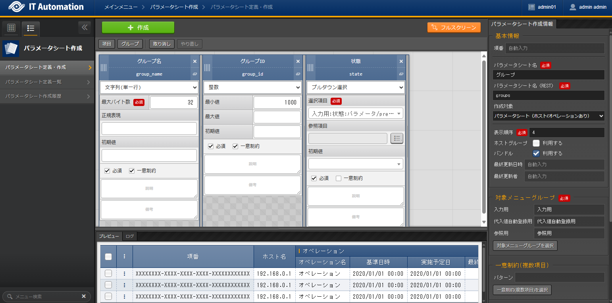

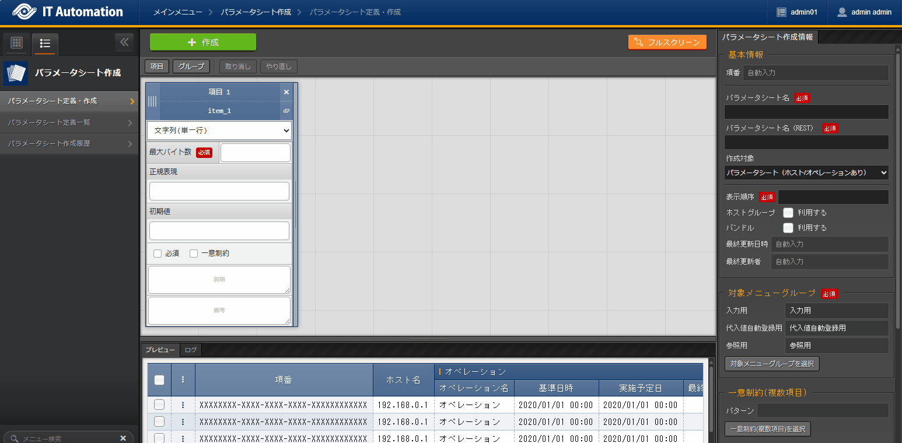

.. list-table:: Group parameter sheet setting values
   :widths: 10 10 10 10
   :header-rows: 1
   :class: filter-table

   * - Setting item
     - Item 1 setting item
     - Item 2 setting item
     - Item 3 setting item
   * - Item name
     - :kbd:`Group name`
     - :kbd:`Group ID`
     - :kbd:`State`
   * - Item name(Rest API) 
     - :kbd:`group_name`
     - :kbd:`group_id`
     - :kbd:`state`
   * - Input method
     - :kbd:`String(Single line)`
     - :kbd:`Integer`
     - :kbd:`Pulldown selection`
   * - Minimum value
     - (No item)
     - 1000
     - (No item)
   * - Maximum value
     - (No item)
     - 
     - (No item)
    * - Maximum byte size
     - :kbd:`32`
     - (No item)
     - (No item)
   * - Regular expression
     - 
     - (No item)
     - (No item)
   * - Select item
     - (No item)
     - (No item)
     - :kbd:`Input:State:present-absent`
   * - Reference item
     - (No item)
     - (No item)
     - 
   * - Default value
     - 
     - 
     - 
   * - Required
     - ✓
     - ✓
     - ✓
   * - Unique restriction
     - ✓
     - ✓
     - 
   * - Description
     - 
     - 
     - 
   * - Remarks
     - 
     - 
     - 

.. list-table:: Parameter creation information setting value
   :widths: 5 10
   :header-rows: 1
   :class: filter-table

   * - Item name
     - Setting value
   * - Item number
     - (Automatic)
   * - Parameter sheet name
     - :kbd:`Group`
   * - Parameter sheet name(REST)
     - :kbd:`groups`
   * - Creation target
     - :kbd:`Parameter sheet(With host/operation)`
   * - Display order
     - :kbd:`4`
   * - Use bundles
     - Check the "Use" box(Activate)
   * - Last updated date/time
     - (Automatic)
   * - Last updated by
     - (Automatic)

Create parameter sheet for users
------------------------------

| Next, we will create a parameter sheets for the users.
| The Ansible Role package used here is the `User settings <https://github.com/exastro-playbook-collection/OS-RHEL8/tree/master/RH_user/OS_build>`_ package. Make sure when creating the parameter sheet that the it can manage the following parameters.

.. list-table:: User settings parameters
   :widths: 10 15
   :header-rows: 1

   * - Item 
     - Description
   * - user_name
     -	User name
   * - user_id
     -	User ID
   * - group_id
     -	Group ID
   * - comment
     -	Comment
   * - home_dir
     - Home directory
   * - login_shell
     - Login shell
   * - password
     -	Password
   * - action
     - | Construction settings
       | present: Create/Update
       | absent: Delete
   * - password_apply
     - | Password settings when constructing
       | true: Will configure a password
       | false: Will not configure a password

.. warning:: 
   | Since the `exastro-playbook-collection <https://github.com/exastro-playbook-collection>`_is delivered containing ITA readme. This means that the user will have to manage parameters for all the variables specified in the ITA readme file.

| From :menuselection:`Create Parameter sheet --> Define/Create Parameter sheet`, register a parameter sheet.

.. tip:: 
   | By configuring :kbd:`Pulldown selection` for the :menuselection:`Input method`, we can reference the datasheet registered in :ref:`groups_legacy_parameter_sheet`.

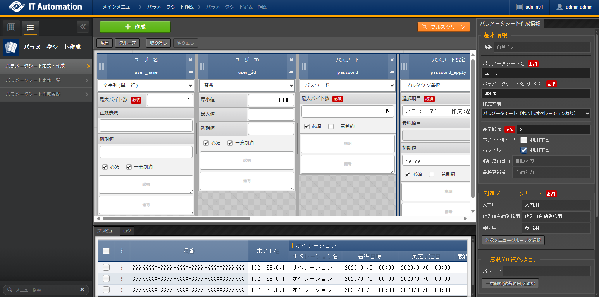

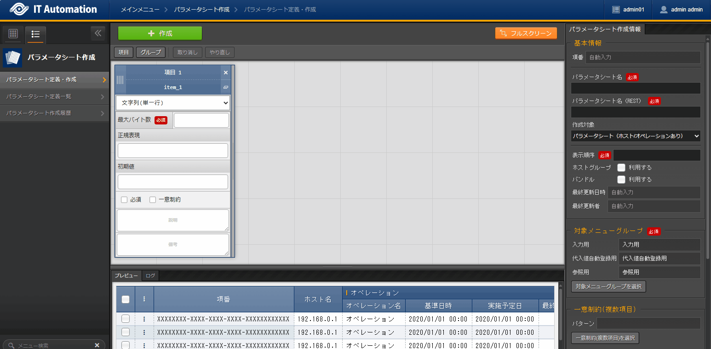

.. list-table:: パラメータ項目の設定値(1/2)
   :widths: 10 10 10 10 10 10
   :header-rows: 1
   :class: filter-table

   * - Setting item
     - Item 1 setting value
     - Item 2 setting value
     - Item 3 setting value
     - Item 4 setting value
     - Item 5 setting value
   * - Item name
     - :kbd:`User name`
     - :kbd:`User ID`
     - :kbd:`Password`
     - :kbd:`Password settings`
     - :kbd:`Group`
   * - Item name(Rest API) 
     - :kbd:`user_name`
     - :kbd:`user_id`
     - :kbd:`password`
     - :kbd:`password_apply`
     - :kbd:`group`
   * - Input method
     - :kbd:`String(Single line)`
     - :kbd:`Integer`
     - :kbd:`Password`
     - :kbd:`Pulldown selection`
     - :kbd:`Pulldown selection`
   * - Maximum byte size
     - :kbd:`32`
     - (No item)
     - :kbd:`32`
     - (No item)
     - (No item)
   * - Regular expression
     - 
     - (No item)
     - (No item)
     - (No item)
     - (No item)
   * - Minimum value
     - (No item)
     - :kbd:`1000`
     - (No item)
     - (No item)
     - (No item)
   * - 最大値
     - (No item)
     - 
     - (No item)
     - (No item)
     - (No item)
   * - Select item
     - (No item)
     - (No item)
     - (No item)
     - :kbd:`Create Parameter sheet:Selection 2:True-False`
     - :kbd:`Input:Group:Group name`
   * - Reference item
     - (No item)
     - (No item)
     - (No item)
     - 
     - 
   * - Default value
     - 
     - 
     - (No item)
     - :kbd:`False`
     - 
   * - Required
     - ✓
     - ✓
     - ✓
     - ✓
     - ✓
   * - Unique restriction
     - ✓
     - ✓
     - 
     - 
     - 
   * - Description
     - 
     - 
     - 
     - 
     - 
   * - Remarks
     - 
     - 
     - 
     - 
     - 

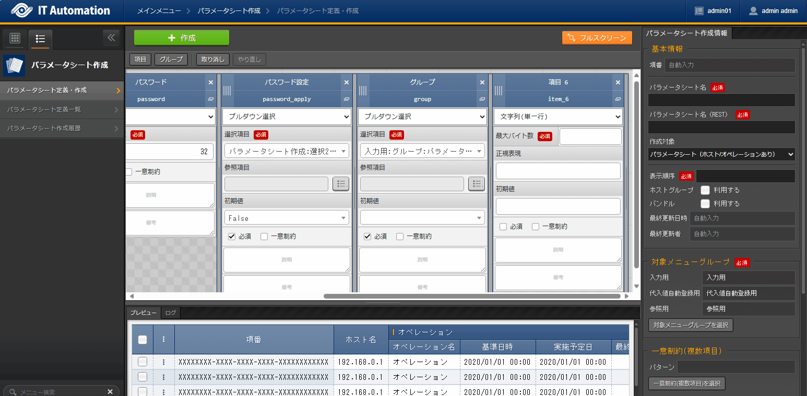

.. list-table:: Parameter item setting value(2/2)
   :widths: 10 10 10 10 10
   :header-rows: 1
   :class: filter-table

   * - Setting item
     - Item 6 setting value
     - Item 7 setting value
     - Item 8 setting value
     - Item 9 setting value
   * - Item name
     - :kbd:`Home directory`
     - :kbd:`Login shell`
     - :kbd:`Comment`
     - :kbd:`State`
   * - Item name(Rest API) 
     - :kbd:`home_dir`
     - :kbd:`login_shell`
     - :kbd:`comment`
     - :kbd:`state`
   * - Input method
     - :kbd:`String(Single line)`
     - :kbd:`String(Single line)`
     - :kbd:`String(Single line)`
     - :kbd:`Pulldown selection`
   * - Maximum byte size
     - :kbd:`128`
     - :kbd:`32`
     - :kbd:`128`
     - (No item)
   * - Regular expression
     - 
     - 
     - 
     - (No item)
   * - Minimum value
     - (No item)
     - (No item)
     - (No item)
     - (No item)
   * - Maximum value
     - (No item)
     - (No item)
     - (No item)
     - (No item)
   * - Select item
     - (No item)
     - (No item)
     - (No item)
     - :kbd:`Input:State:present-absent`
   * - Reference item
     - (No item)
     - (No item)
     - (No item)
     - 
   * - Default value
     - 
     - :kbd:`/bin/bash`
     - 
     - 
   * - Required
     - ✓
     - ✓
     - ✓
     - ✓
   * - Unique restriction
     - 
     - 
     - 
     - 
   * - Description
     - 
     - 
     - 
     - 
   * - Remarks
     - 
     - 
     - 
     - 

.. list-table:: Parameter sheet creation information and setting values
   :widths: 5 10
   :header-rows: 1
   :class: filter-table

   * - Item name
     - Setting value
   * - Item number
     - (Automatic)
   * - Parameter sheet name
     - :kbd:`User`
   * - Parameter sheet name(REST)
     - :kbd:`users`
   * - Creation target
     - :kbd:`Parameter sheet(With host/operation)`
   * - Display order
     - :kbd:`3`
   * - Use bundles
     - Check the "Use" box(Activate)
   * - Last updated date/time
     - (Automatic)
   * - Last updated by
     - (Automatic)

Register operation steps
==============

| We will now configure a Movement so when the Ansible Role is executed, the Group(s) are created/deleted and then the users are created/deleted.
| Up until now, we have only linked 1 Ansible Role per movement. But in this one, we will manage both groups and users with 1 Movement.

.. note:: 
   | We can achieve the same result by creating 1 Movement for both managing groups and managing users.

Movement 登録
-------------

| From :menuselection:`Ansible-LegacyRole --> Movement list`, register a Movement for managing users.

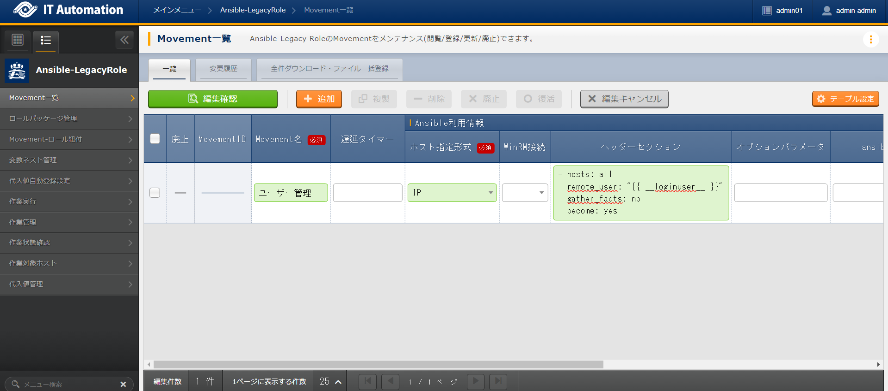
   
.. list-table:: Movement information setting value
   :widths: 10 10 10
   :header-rows: 2

   * - Movement name
     - Ansible use information
     - 
   * - 
     - Host specification method
     - Header section
   * - :kbd:`User management`
     - :kbd:`IP`
     - :kbd:`※reference Header section`

.. code-block:: bash
   :caption: Header section

   - hosts: all
     remote_User: "{{ __loginuser__ }}"
     gather_facts: no
     become: yes

Register Ansible Role
-----------------

| In this scenario, we will use the `Exastro Playbook Collection <https://github.com/exastro-suite/playbook-collection-docs/blob/master/ansible_role_packages/README.md>`_role package registered in the :doc:`previous scenario <scenario1>`. No additional registration of configuration is required.

Link Movement and Ansible Role
---------------------------------

| From the :menuselection:`Ansible-LegacyRole --> Movement-Role link` menu, link the Movement with the Ansible Role packages.
| In this scenario, we will use `Ansible Role package for Group management <https://github.com/exastro-playbook-collection/OS-RHEL8/tree/master/RH_group/OS_build>` and `Ansible Role package for User management <https://github.com/exastro-playbook-collection/OS-RHEL8/tree/master/RH_user/OS_build>`.
| When creating users, we must first specify the group they belong to, meaning that we will have to include the following display orders.

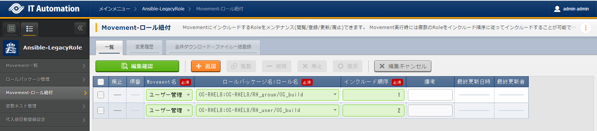

.. list-table:: Register Movement-Role link information
  :widths: 10 30 10
  :header-rows: 1

  * - Movement name
    - Role package name: Role name
    - Include order
  * - :kbd:`User management`
    - :kbd:`OS-RHEL8:OS-RHEL8/RH_group/OS_build`
    - :kbd:`1`
  * - :kbd:`User management`
    - :kbd:`OS-RHEL8:OS-RHEL8/RH_user/OS_build`
    - :kbd:`2`

Variable nest management
--------------

| From the :menuselection:`Ansible-LegacyRole --> Variable nest management` menu, configure the max value for number of users and groups that can be managed.

| The variables for Group and users are the following multi-stage variables.

.. code-block:: yaml
   :caption: VAR_RH_group variable structure(=Multi-stage variable)

   # Indefinite number variable set (action and pkg name) repeats for VAR_RH_group
   VAR_RH_group:
   - action: present
     group_id: '1100'
     group_name: testgroup
   - action: present
     group_id: '1101'
     group_name: testgroup2
   - action: absent
     group_name: testgroup3
     ...

.. code-block:: yaml
   :caption: VAR_RH_user の変数構造(=多段変数)

   # Indefinite number variable set (action and pkg name) repeats for VAR_RH_user
   VAR_RH_user:
   - action: present
     comment: create testuser
     group_id: '1100'
     home_dir: /home/testuser
     login_shell: /bin/bash
     password: p@ssw0rd123
     password_apply: true
     user_id: '1100'
     user_name: testuser
   - action: present
     comment: update testuser2
     group_id: '1101'
     home_dir: /home/testuser2
     login_shell: /bin/bash
     password_apply: false
     user_id: '1102'
     user_name: testuser2
   - action: absent
     user_name: testuser99
     ...

| For multi-stage variables, the user must determine a max number in advance.

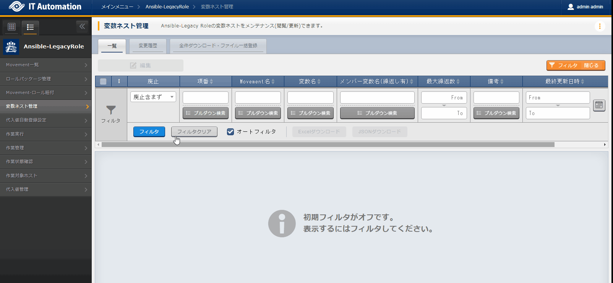

.. list-table:: Variable nest information registration
   :widths: 10 10 20 10
   :header-rows: 1

   * - Movement name
     - Variable name
     - Member variable name(Repeating)
     - Maximum repetitions
   * - :kbd:`User management`
     - :kbd:`VAR_RH_group`
     - :kbd:`0`
     - :kbd:`5`
   * - :kbd:`User management`
     - :kbd:`VAR_RH_user`
     - :kbd:`0`
     - :kbd:`10`

Substitute value auto registration settings
------------------

| From the :menuselection:`Ansible-LegacyRole --> Substitute value auto registration settings` menu, link the parameter sheet items with the Ansible Role package variables.
| If the user wants to register large amounts of data, we recommend that they use the Download all/File bulk registration function.
| From :menuselection:`Ansible-LegacyRole --> Substitute value auto registration settings` --> Download all/File bulk registration, download the file for new registrations. Users can then edit the file to register files and substitute value auto registration settings more easily.

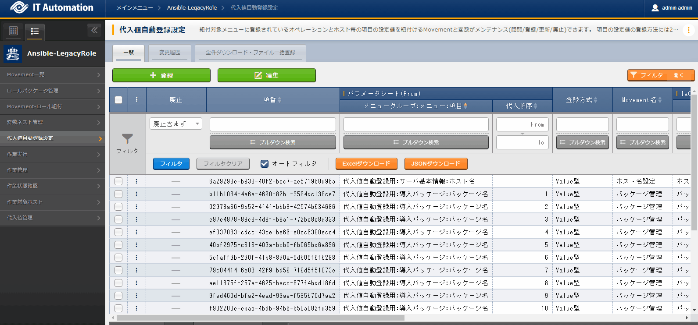

.. list-table:: Group substitute value auto registration settings Setting values
  :widths: 40 10 10 20 20 30
  :header-rows: 2

  * - Parameter sheet(From)
    -
    - Registration method
    - Movement name
    - IaC variable(To)
    -
  * - Menu group:Menu:Item
    - Substitute order
    -
    -
    - Movement name:Variable name
    - Movement name:Variable name:Member variable
  * - :kbd:`Substitute value auto registration settings:Group:Group name`
    - :kbd:`1`
    - :kbd:`Value type`
    - :kbd:`User management`
    - :kbd:`User management:VAR_RH_group`
    - :kbd:`User management:VAR_RH_group:[0].group_name`
  * - :kbd:`Substitute value auto registration settings:Group:Group ID`
    - :kbd:`1`
    - :kbd:`Value type`
    - :kbd:`User management`
    - :kbd:`User management:VAR_RH_group`
    - :kbd:`User management:VAR_RH_group:[0].group_id`
  * - :kbd:`Substitute value auto registration settings:Group:State`
    - :kbd:`1`
    - :kbd:`Value type`
    - :kbd:`User management`
    - :kbd:`User management:VAR_RH_group`
    - :kbd:`User management:VAR_RH_group:[0].action`
  * - :kbd:`Substitute value auto registration settings:Group:Group name`
    - :kbd:`2`
    - :kbd:`Value type`
    - :kbd:`User management`
    - :kbd:`User management:VAR_RH_group`
    - :kbd:`User management:VAR_RH_group:[1].group_name`
  * - :kbd:`Substitute value auto registration settings:Group:Group ID`
    - :kbd:`2`
    - :kbd:`Value type`
    - :kbd:`User management`
    - :kbd:`User management:VAR_RH_group`
    - :kbd:`User management:VAR_RH_group:[1].group_id`
  * - :kbd:`Substitute value auto registration settings:Group:State`
    - :kbd:`2`
    - :kbd:`Value type`
    - :kbd:`User management`
    - :kbd:`User management:VAR_RH_group`
    - :kbd:`User management:VAR_RH_group:[1].action`
  * - :kbd:`...`
    - :kbd:`...`
    - :kbd:`...`
    - :kbd:`...`
    - :kbd:`...`
    - :kbd:`...`
  * - :kbd:`Substitute value auto registration settings:Group:Group name`
    - :kbd:`5`
    - :kbd:`Value type`
    - :kbd:`User management`
    - :kbd:`User management:VAR_RH_group`
    - :kbd:`User management:VAR_RH_group:[4].group_name`
  * - :kbd:`Substitute value auto registration settings:Group:Group ID`
    - :kbd:`5`
    - :kbd:`Value type`
    - :kbd:`User management`
    - :kbd:`User management:VAR_RH_group`
    - :kbd:`User management:VAR_RH_group:[4].group_id`
  * - :kbd:`Substitute value auto registration settings:Group:State`
    - :kbd:`5`
    - :kbd:`Value type`
    - :kbd:`User management`
    - :kbd:`User management:VAR_RH_group`
    - :kbd:`User management:VAR_RH_group:[4].action`

.. figure:: ../../../../images/learn/quickstart/answer1/ユーザーの代入値自動登録設定.gif
   :width: 1200px
   :alt: Substitute value auto registration settings for User

.. list-table:: Substitute value auto registration settings values for User 
  :widths: 40 10 10 20 20 30
  :header-rows: 2

  * - Parameter sheet(From)
    -
    - Registration method
    - Movement name
    - IaC variables(To)
    -
  * - Menu group:Menu:Item
    - Substitute order
    -
    -
    - Movement name:Variable name
    - Substitute order
  * - :kbd:`Substitute value auto registration settings:User:User name`
    - :kbd:`1`
    - :kbd:`Value type`
    - :kbd:`User management`
    - :kbd:`User management:VAR_RH_user`
    - :kbd:`User management:VAR_RH_user:[0].user_name`
  * - :kbd:`Substitute value auto registration settings:User:User ID`
    - :kbd:`1`
    - :kbd:`Value type`
    - :kbd:`User management`
    - :kbd:`User management:VAR_RH_user`
    - :kbd:`User management:VAR_RH_user:[0].user_id`
  * - :kbd:`Substitute value auto registration settings:User:Password`
    - :kbd:`1`
    - :kbd:`Value type`
    - :kbd:`User management`
    - :kbd:`User management:VAR_RH_user`
    - :kbd:`User management:VAR_RH_user:[0].password`
  * - :kbd:`Substitute value auto registration settings:User:Password settings`
    - :kbd:`1`
    - :kbd:`Value type`
    - :kbd:`User management`
    - :kbd:`User management:VAR_RH_user`
    - :kbd:`User management:VAR_RH_user:[0].password_apply`
  * - :kbd:`Substitute value auto registration settings:User:Group`
    - :kbd:`1`
    - :kbd:`Value type`
    - :kbd:`User management`
    - :kbd:`User management:VAR_RH_user`
    - :kbd:`User management:VAR_RH_user:[0].group_id`
  * - :kbd:`Substitute value auto registration settings:User:Home directory`
    - :kbd:`1`
    - :kbd:`Value type`
    - :kbd:`User management`
    - :kbd:`User management:VAR_RH_user`
    - :kbd:`User management:VAR_RH_user:[0].home_dir`
  * - :kbd:`Substitute value auto registration settings:User:Login shell`
    - :kbd:`1`
    - :kbd:`Value type`
    - :kbd:`User management`
    - :kbd:`User management:VAR_RH_user`
    - :kbd:`User management:VAR_RH_user:[0].login_shell`
  * - :kbd:`Substitute value auto registration settings:User:Comment`
    - :kbd:`1`
    - :kbd:`Value type`
    - :kbd:`User management`
    - :kbd:`User management:VAR_RH_user`
    - :kbd:`User management:VAR_RH_user:[0].comment`
  * - :kbd:`Substitute value auto registration settings:User:State`
    - :kbd:`1`
    - :kbd:`Value type`
    - :kbd:`User management`
    - :kbd:`User management:VAR_RH_user`
    - :kbd:`User management:VAR_RH_user:[0].action`
  * - :kbd:`Substitute value auto registration settings:User:User name`
    - :kbd:`2`
    - :kbd:`Value type`
    - :kbd:`User management`
    - :kbd:`User management:VAR_RH_user`
    - :kbd:`User management:VAR_RH_user:[1].user_name`
  * - :kbd:`Substitute value auto registration settings:User:User ID`
    - :kbd:`2`
    - :kbd:`Value type`
    - :kbd:`User management`
    - :kbd:`User management:VAR_RH_user`
    - :kbd:`User management:VAR_RH_user:[1].user_id`
  * - :kbd:`Substitute value auto registration settings:User:Password`
    - :kbd:`2`
    - :kbd:`Value type`
    - :kbd:`User management`
    - :kbd:`User management:VAR_RH_user`
    - :kbd:`User management:VAR_RH_user:[1].password`
  * - :kbd:`Substitute value auto registration settings:User:Password settings`
    - :kbd:`2`
    - :kbd:`Value type`
    - :kbd:`User management`
    - :kbd:`User management:VAR_RH_user`
    - :kbd:`User management:VAR_RH_user:[1].password_apply`
  * - :kbd:`Substitute value auto registration settings:User:Group`
    - :kbd:`2`
    - :kbd:`Value type`
    - :kbd:`User management`
    - :kbd:`User management:VAR_RH_user`
    - :kbd:`User management:VAR_RH_user:[1].group_id`
  * - :kbd:`Substitute value auto registration settings:User:Home directory`
    - :kbd:`2`
    - :kbd:`Value type`
    - :kbd:`User management`
    - :kbd:`User management:VAR_RH_user`
    - :kbd:`User management:VAR_RH_user:[1].home_dir`
  * - :kbd:`Substitute value auto registration settings:User:Login shell`
    - :kbd:`2`
    - :kbd:`Value type`
    - :kbd:`User management`
    - :kbd:`User management:VAR_RH_user`
    - :kbd:`User management:VAR_RH_user:[1].login_shell`
  * - :kbd:`Substitute value auto registration settings:User:Comment`
    - :kbd:`2`
    - :kbd:`Value type`
    - :kbd:`User management`
    - :kbd:`User management:VAR_RH_user`
    - :kbd:`User management:VAR_RH_user:[1].comment`
  * - :kbd:`Substitute value auto registration settings:User:State`
    - :kbd:`2`
    - :kbd:`Value type`
    - :kbd:`User management`
    - :kbd:`User management:VAR_RH_user`
    - :kbd:`User management:VAR_RH_user:[1].action`
  * - :kbd:`Substitute value auto registration settings:User:User name`
    - :kbd:`3`
    - :kbd:`Value type`
    - :kbd:`User management`
    - :kbd:`User management:VAR_RH_user`
    - :kbd:`User management:VAR_RH_user:[2].user_name`
  * - :kbd:`Substitute value auto registration settings:User:User ID`
    - :kbd:`3`
    - :kbd:`Value type`
    - :kbd:`User management`
    - :kbd:`User management:VAR_RH_user`
    - :kbd:`User management:VAR_RH_user:[2].user_id`
  * - :kbd:`Substitute value auto registration settings:User:Password`
    - :kbd:`3`
    - :kbd:`Value type`
    - :kbd:`User management`
    - :kbd:`User management:VAR_RH_user`
    - :kbd:`User management:VAR_RH_user:[2].password`
  * - :kbd:`Substitute value auto registration settings:User:Password settings`
    - :kbd:`3`
    - :kbd:`Value type`
    - :kbd:`User management`
    - :kbd:`User management:VAR_RH_user`
    - :kbd:`User management:VAR_RH_user:[2].password_apply`
  * - :kbd:`Substitute value auto registration settings:User:Group`
    - :kbd:`3`
    - :kbd:`Value type`
    - :kbd:`User management`
    - :kbd:`User management:VAR_RH_user`
    - :kbd:`User management:VAR_RH_user:[2].group_id`
  * - :kbd:`Substitute value auto registration settings:User:Home directory`
    - :kbd:`3`
    - :kbd:`Value type`
    - :kbd:`User management`
    - :kbd:`User management:VAR_RH_user`
    - :kbd:`User management:VAR_RH_user:[2].home_dir`
  * - :kbd:`Substitute value auto registration settings:User:Login shell`
    - :kbd:`3`
    - :kbd:`Value type`
    - :kbd:`User management`
    - :kbd:`User management:VAR_RH_user`
    - :kbd:`User management:VAR_RH_user:[2].login_shell`
  * - :kbd:`Substitute value auto registration settings:User:Comment`
    - :kbd:`3`
    - :kbd:`Value type`
    - :kbd:`User management`
    - :kbd:`User management:VAR_RH_user`
    - :kbd:`User management:VAR_RH_user:[2].comment`
  * - :kbd:`Substitute value auto registration settings:User:State`
    - :kbd:`3`
    - :kbd:`Value type`
    - :kbd:`User management`
    - :kbd:`User management:VAR_RH_user`
    - :kbd:`User management:VAR_RH_user:[2].action`
  * - :kbd:`Substitute value auto registration settings:User:User name`
    - :kbd:`4`
    - :kbd:`Value type`
    - :kbd:`User management`
    - :kbd:`User management:VAR_RH_user`
    - :kbd:`User management:VAR_RH_user:[3].user_name`
  * - :kbd:`Substitute value auto registration settings:User:User ID`
    - :kbd:`4`
    - :kbd:`Value type`
    - :kbd:`User management`
    - :kbd:`User management:VAR_RH_user`
    - :kbd:`User management:VAR_RH_user:[3].user_id`
  * - :kbd:`Substitute value auto registration settings:User:Password`
    - :kbd:`4`
    - :kbd:`Value type`
    - :kbd:`User management`
    - :kbd:`User management:VAR_RH_user`
    - :kbd:`User management:VAR_RH_user:[3].password`
  * - :kbd:`Substitute value auto registration settings:User:Password settings`
    - :kbd:`4`
    - :kbd:`Value type`
    - :kbd:`User management`
    - :kbd:`User management:VAR_RH_user`
    - :kbd:`User management:VAR_RH_user:[3].password_apply`
  * - :kbd:`Substitute value auto registration settings:User:Group`
    - :kbd:`4`
    - :kbd:`Value type`
    - :kbd:`User management`
    - :kbd:`User management:VAR_RH_user`
    - :kbd:`User management:VAR_RH_user:[3].group_id`
  * - :kbd:`Substitute value auto registration settings:User:Home directory`
    - :kbd:`4`
    - :kbd:`Value type`
    - :kbd:`User management`
    - :kbd:`User management:VAR_RH_user`
    - :kbd:`User management:VAR_RH_user:[3].home_dir`
  * - :kbd:`Substitute value auto registration settings:User:Login shell`
    - :kbd:`4`
    - :kbd:`Value type`
    - :kbd:`User management`
    - :kbd:`User management:VAR_RH_user`
    - :kbd:`User management:VAR_RH_user:[3].login_shell`
  * - :kbd:`Substitute value auto registration settings:User:Comment`
    - :kbd:`4`
    - :kbd:`Value type`
    - :kbd:`User management`
    - :kbd:`User management:VAR_RH_user`
    - :kbd:`User management:VAR_RH_user:[3].comment`
  * - :kbd:`Substitute value auto registration settings:User:State`
    - :kbd:`4`
    - :kbd:`Value type`
    - :kbd:`User management`
    - :kbd:`User management:VAR_RH_user`
    - :kbd:`User management:VAR_RH_user:[3].action`
  * - :kbd:`...`
    - :kbd:`...`
    - :kbd:`...`
    - :kbd:`...`
    - :kbd:`...`
    - :kbd:`...`
  * - :kbd:`Substitute value auto registration settings:User:User name`
    - :kbd:`10`
    - :kbd:`Value type`
    - :kbd:`User management`
    - :kbd:`User management:VAR_RH_user`
    - :kbd:`User management:VAR_RH_user:[9].user_name`
  * - :kbd:`Substitute value auto registration settings:User:User ID`
    - :kbd:`10`
    - :kbd:`Value type`
    - :kbd:`User management`
    - :kbd:`User management:VAR_RH_user`
    - :kbd:`User management:VAR_RH_user:[9].user_id`
  * - :kbd:`Substitute value auto registration settings:User:Password`
    - :kbd:`10`
    - :kbd:`Value type`
    - :kbd:`User management`
    - :kbd:`User management:VAR_RH_user`
    - :kbd:`User management:VAR_RH_user:[9].password`
  * - :kbd:`Substitute value auto registration settings:User:Password settings`
    - :kbd:`10`
    - :kbd:`Value type`
    - :kbd:`User management`
    - :kbd:`User management:VAR_RH_user`
    - :kbd:`User management:VAR_RH_user:[9].password_apply`
  * - :kbd:`Substitute value auto registration settings:User:Group`
    - :kbd:`10`
    - :kbd:`Value type`
    - :kbd:`User management`
    - :kbd:`User management:VAR_RH_user`
    - :kbd:`User management:VAR_RH_user:[9].group_id`
  * - :kbd:`Substitute value auto registration settings:User:Home directory`
    - :kbd:`10`
    - :kbd:`Value type`
    - :kbd:`User management`
    - :kbd:`User management:VAR_RH_user`
    - :kbd:`User management:VAR_RH_user:[9].home_dir`
  * - :kbd:`Substitute value auto registration settings:User:Login shell`
    - :kbd:`10`
    - :kbd:`Value type`
    - :kbd:`User management`
    - :kbd:`User management:VAR_RH_user`
    - :kbd:`User management:VAR_RH_user:[9].login_shell`
  * - :kbd:`Substitute value auto registration settings:User:Comment`
    - :kbd:`10`
    - :kbd:`Value type`
    - :kbd:`User management`
    - :kbd:`User management:VAR_RH_user`
    - :kbd:`User management:VAR_RH_user:[9].comment`
  * - :kbd:`Substitute value auto registration settings:User:State`
    - :kbd:`10`
    - :kbd:`Value type`
    - :kbd:`User management`
    - :kbd:`User management:VAR_RH_user`
    - :kbd:`User management:VAR_RH_user:[9].action`

Register operation target
==============

| Register the target device where the operations will be executed to.

Register device
--------

| We will use the web01 server registered in the :doc:`previous scenario <scenario1>`, meaning no additional steps are required.

Add users
======================

| Run the Movement and add user and group.

Create Operation overview
--------------

| Start with planning the operation.

.. list-table:: Operation overview
   :widths: 15 10
   :header-rows: 0

   * - Execution date/time
     - 2023/04/04 12:00:00
   * - Target
     - web01(RHEL8)
   * - Contents
     - Add user to Web server

Register operation overview
------------

| From :menuselection:`Basic console --> Operation list`, register the execution date and execution name.

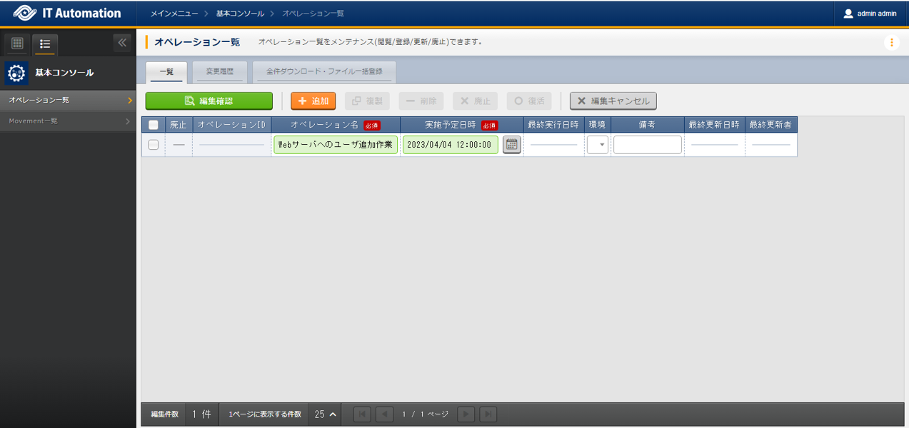

.. list-table:: Operation registration contents
   :widths: 15 10
   :header-rows: 1

   * - Operation name
     - Execution date/time
   * - :kbd:`Add user to Web server`
     - :kbd:`2023/04/04 12:00:00`

Configure Parameters
--------------

| From :menuselection:`Input --> Group`, reigster the parameters for the groups.

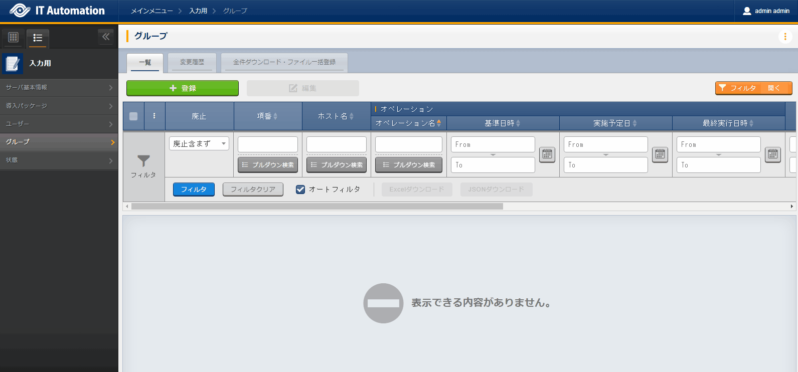

.. list-table:: Group parameter setting values
  :widths: 5 20 5 5 5 5
  :header-rows: 2

  * - Host name
    - Operation
    - Substitute order
    - Parameter
    - 
    - 
  * - 
    - Operation name
    - 
    - Group name
    - Group ID
    - State
  * - web01
    - :kbd:`2023/04/04 12:00:00_Add user to Web server`
    - :kbd:`1`
    - :kbd:`www`
    - :kbd:`10001`
    - :kbd:`present`
  * - web01
    - :kbd:`2023/04/04 12:00:00_Add user to Web server`
    - :kbd:`2`
    - :kbd:`app`
    - :kbd:`10002`
    - :kbd:`present`

| From :menuselection:`Input --> User` register the parameters for the users.
| If the user wants to register large amounts of data, we recommend that they use the Download all/File bulk registration function.
| From :menuselection:`Ansible-LegacyRole --> Substitute value auto registration settings` --> Download all/File bulk registration, download the file for new registrations. Users can then edit the file to register files and substitute value auto registration settings more easily.

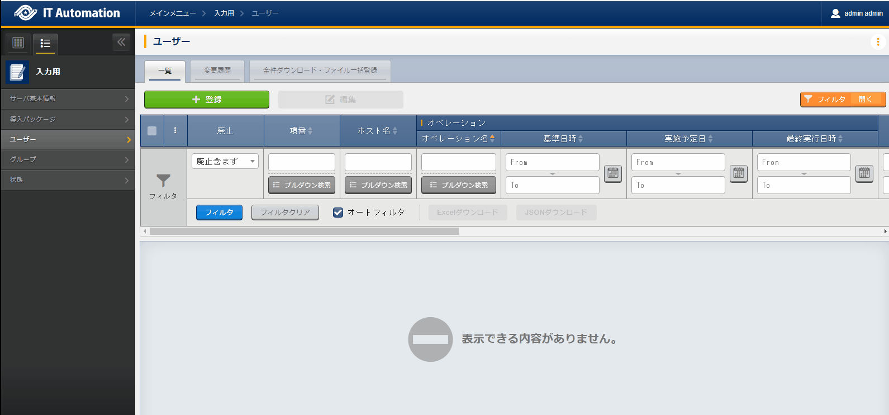

.. list-table:: User parameter setting values
  :widths: 5 20 5 5 5 5 5 5 10 5 10 5
  :header-rows: 2

  * - Host name
    - Operation
    - Substitute order
    - Parameter
    - 
    - 
    - 
    - 
    - 
    - 
    - 
    - 
  * - 
    - Operation name
    - 
    - User name
    - User ID
    - Password
    - Password settings
    - Group
    - Home directory
    - Login shell
    - Comment
    - State
  * - web01
    - :kbd:`2023/04/04 12:00:00_Add user to Web server`
    - :kbd:`1`
    - :kbd:`wwwuser01`
    - :kbd:`10001`
    - :kbd:`password01`
    - :kbd:`True`
    - :kbd:`www`
    - :kbd:`/home/wwwuser01`
    - :kbd:`/bin/bash`
    - :kbd:`Web server maintainer`
    - :kbd:`present`
  * - web01
    - :kbd:`2023/04/04 12:00:00_Add user to Web server`
    - :kbd:`2`
    - :kbd:`wwwuser02`
    - :kbd:`10002`
    - :kbd:`password02`
    - :kbd:`True`
    - :kbd:`www`
    - :kbd:`/home/wwwuser02`
    - :kbd:`/bin/bash`
    - :kbd:`Web server maintainer`
    - :kbd:`present`
  * - web01
    - :kbd:`2023/04/04 12:00:00_Add user to Web server`
    - :kbd:`3`
    - :kbd:`appuser01`
    - :kbd:`20001`
    - :kbd:`password01`
    - :kbd:`True`
    - :kbd:`app`
    - :kbd:`/home/appuser01`
    - :kbd:`/bin/bash`
    - :kbd:`Application server maintainer`
    - :kbd:`present`
  * - web01
    - :kbd:`2023/04/04 12:00:00_Add user to Web server`
    - :kbd:`4`
    - :kbd:`appuser02`
    - :kbd:`20002`
    - :kbd:`password02`
    - :kbd:`True`
    - :kbd:`app`
    - :kbd:`/home/appuser02`
    - :kbd:`/bin/bash`
    - :kbd:`Application server maintainer`
    - :kbd:`present`

Run operation
--------

1. Pre-confirmation

   | Confirm the current state of the server.

   | Confirm group list.

   .. code-block:: bash
      :caption: Command

      # Fetch group list
      cat /etc/group|grep -E "www|app"

   .. code-block:: bash
      :caption: Results

      # Displays nothing

   | Confirm user list.

   .. code-block:: bash
      :caption: Command

      # Fetch user list
      cat /etc/passwd|grep -E "www|app"

   .. code-block:: bash
      :caption: Results

      # Displays nothing

2. Run operation

   | From :menuselection:`Ansible-LegacyRole --> Execution`, select the :kbd:`User management` Movement and press :guilabel:` Execute`.
   | Next, in the :menuselection:`Execution settings`, select :kbd:`Add user to Web server` and press :guilabel:`Execute`.

   | This opens the  :menuselection:`Execuction status confirmation` page. In here, check that the status says "Complete" after the execution has finished.

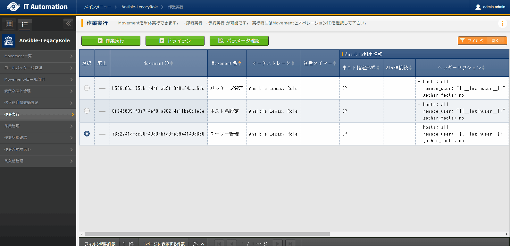

1. Post-confirmation

   | Check that the following groups and users has been configured.

   | Confirm group list.

   .. code-block:: bash
      :caption: Command

      # Fetch group list
      cat /etc/group|grep -E "app|www"

   .. code-block:: bash
      :caption: Results

      www:x:10001:
      app:x:10002:

   | Confirm user list.

   .. code-block:: bash
      :caption: Command

      # Fetch user list
      cat /etc/passwd|grep -E "app|www"

   .. code-block:: bash
      :caption: Results

      wwwuser01:x:10001:10001:Web server mainterner:/home/wwwuser01:/bin/bash
      wwwuser02:x:10002:10001:Web server mainterner:/home/wwwuser02:/bin/bash
      appuser01:x:20001:10002:Application server mainterner:/home/appuser01:/bin/bash
      appuser02:x:20002:10002:Application server mainterner:/home/appuser02:/bin/bash

(Reference) Adding to existing jobflows
=================================

| In this scenario, although the users directly configured users by using Movements, the same can be done through jobflows as well.
| By including the Movements created in this scenario in the Server construction operations in the Jobflow scenario, users can register host names, install packages and register users in one jobflow.
| In order to do so, the user would have to following the steps below.

1. Create Jobflow
2. Register operations
3. Register host name parameters (No parameter changes)
4. Register package parameters (No parameter changes)
5. Register group parameters
6. Register user parameters
7. Run Jobflow

| Do note that in Exastro IT Automation, parameters must be registered for each linked operation and device. This means that not only must the user configure the group and user, but also parameters for the host names and packages.

| For cases like this, users can use individual operations and configure them to Movements.
| However, note that if individual operations are used, the managed parameters will be different from the operations when executed. 

Executing and editing Jobflow (Bad example)
---------------------------------

| From the :menuselection:`Conductor --> Conductor list` menu, press the :guilabel:`Details` button under :kbd:`Construct server` and edit the Jobflow.

| 1. Press the :guilabel:` Edit` button on the top of the page and change to Edit mode.
| 2. All the :kbd:`User management` Movements can be seen in the bottom right panel. Drag and drop them to the middle of the screen.
| 3. Follow the table below and connect the different Nodes to each other.
 
.. list-table:: Operation connections
   :widths: 10 10
   :header-rows: 1

   * - OUT
     - IN
   * - :kbd:`Start`
     - :kbd:`Host name settings`
   * - :kbd:`Host name settings`
     - :kbd:`Package management`
   * - :kbd:`Package management`
     - :kbd:`User management`
   * - :kbd:`User management`
     - :kbd:`End`

| 4. Press the :guilabel:` Update` button on the top of the page.
| 5. From the :menuselection:`Conductor --> Conductor edit/execute` menu, press the :guilabel:` Select` button.
| 6. Select the :kbd:`Construct server` Conductor and press the :guilabel:`Select` button.
| 7. Select the  :kbd:`Add user to Web server` operation and press the :guilabel:`Execute` button.

.. figure:: ../../../../images/learn/quickstart/answer1/実行失敗.gif
   :width: 1200px
   :alt: Failed execution

| The :menuselection:`Conductor execution confirmation` menu will be opened and the "Host name configuration" Movement should display "Unexpected error".
| This is caused by the :kbd:`Add user to Web server` not having any host name parameters linked to it.

Executing and editing Jobflow (Good example)
---------------------------------

| From the :menuselection:`Conductor --> Conductor list` menu, press the :guilabel:`Details` button under :kbd:`Construct server` and edit the Jobflow.

| 1. Press the :guilabel:` Edit` button on the top of the page and change to Edit mode.
| 2. All the :kbd:`User management` Movements can be seen in the bottom right panel. Drag and drop them to the middle of the screen.
| 3. Follow the table below and connect the different Nodes to each other.
 
.. list-table:: Operation connections
   :widths: 10 10
   :header-rows: 1

   * - Movement
     - Operation name
   * - :kbd:`Host name settings`
     - :kbd:`RHEL8 host name change operation`
   * - :kbd:`Package management`
     - :kbd:`RHEL8 package management`
   * - :kbd:`User management`
     - :kbd:`Add user to Web server`

| 4. Press the :guilabel:` Update` button on the top of the page.
| 5. From the :menuselection:`Conductor --> Conductor edit/execute` menu, press the :guilabel:` Select` button.
| 6. Select the :kbd:`Construct server` Conductor and press the :guilabel:`Select` button.
| 7. Select the  :kbd:`Add user to Web server` operation and press the :guilabel:`Execute` button.

.. figure:: ../../../../images/learn/quickstart/answer1/実行成功.gif
   :width: 1200px
   :alt: Successful execution

| The :menuselection:`Conductor execution confirmation` menu will be opened and all Movements should display "Complete".

Summary
======

| This scenario acted as a test where users could test their knowledge from the previous scenarios.
| Users were also introduced to individual operations, which can be used to link Conductor parameters.
| For more information, see :doc:`../../../manuals/index`.